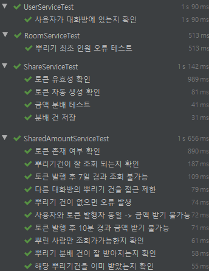

## 카카오페이 뿌리기 기능 구현하기 by 김동우

## 1. 요구 사항
* 뿌리기, 받기, 조회 기능을 수행하는 REST API 를 구현합니다.
    * 요청한 사용자의 식별값은 숫자 형태이며 "X-USER-ID" 라는 HTTP Header로 전달됩니다.
    * 요청한 사용자가 속한 대화방의 식별값은 문자 형태이며 "X-ROOM-ID" 라는 HTTP Header로 전달됩니다. 
    * 모든 사용자는 뿌리기에 충분한 잔액을 보유하고 있다고 가정하여 별도로 잔액에 관련된 체크는 하지 않습니다.
    * 작성하신 어플리케이션이 다수의 서버에 다수의 인스턴스로 동작하더라도 기능에 문제가 없도록 설계되어야 합니다.
    * 각 기능 및 제약사항에 대한 단위테스트를 반드시 작성합니다.


## 2. Problem Solving    
### 1) Development environment
* Language : **Java 11**
* FrameWork : **Spring Boot 2.3.6.RELEASE + Spring JPA + Junit 5**
* Database : **H2 1.4.199.RELEASE** (application.yml 참고) 

    ``` 
    datasource:
        * url: jdbc:h2:tcp://localhost/~/kakaopay
        * username: sa
        * password:
        * driver-class-name: org.h2.Driver
    ```
### 2) Database Modeling
* 응집도를 높이기 위해 각 도메인 별로 __생성 메소드__ 및 __연관관계 메소드__ 활용.
* **핵심 TABLE 및 DDL**
   * **Share : 뿌리기 테이블** `->
        고유 토큰은 KEY값이 될 수 있으나 문자열이므로 Unique로 제약하고 별도의 PK을 사용한다.`
   * **SharedAmount : 받기 테이블**
``` H2 Database
create table share (
    x_share_id bigint not null, -- 뿌리기 PK 
    x_token varchar(255), -- 고유 토큰, unique 제약 조건
    x_user_id bigint, -- 뿌린 사용자
    x_room_id bigint, -- 뿌려진 방
    x_init_amt bigint not null, -- 최초 뿌린 금액
    x_curr_amt bigint not null, -- 현재 남은 금액
    x_init_cnt integer not null,-- 최초 뿌린 수
    x_curr_cnt integer not null, -- 현재 받은 사람
    x_req_created_time timestamp not null, -- 뿌리기 생성 시간
    x_req_ended_time timestamp, -- 뿌리기 종료 시간
    primary key (x_share_id));

alter table share add constraint UK_lgtx6v5oll9i8uhgno0ady7ud unique (x_token);    

create table sharedamount (
    x_shared_amt_id bigint not null, -- 받기 PK
    x_share_id bigint, -- Share 테이블 FK
    x_seq integer not null, -- 토큰 당 분배 시퀀스
    x_rcv_amt bigint not null, -- 분배 금액
    x_rcv_id bigint, -- 분배 받은 사용자
    x_rcv_time timestamp, -- 분배 받은 시각
    primary key (x_shared_amt_id))
```          
    
* ERD

    

* (추가적으로) 관리용 TABLE 생성
    * User : 사용자 관리 테이블
    * UserRoom : 대화방에 소속된 사용자 관리 테이블
    * Room : 대화방 관리 테이블

* Dummy Data
  * User, UserRoom, Room 테이블의 Dummy Data
  * 실행 시 __InitDB.java__의 @PostConstruct로 인해 Dummy Data가 Insert
  * **Dummy Data의 구조 (UserRoom 테이블 참고)** `-> 대화방에 특정 사용자들이 존재함을 표현`
  
    |   |roomA  |roomB  |roomC  |roomD  |roomE  |
    |---|:-----:|:-----:|:-----:|:-----:|:-----:|
    |U  |1      |4      |1      |4      |7      |
    |S  |4      |10     |7      |7      |13     |
    |R  |7      |       |10     |10     |       |
    |I  |10     |       |       |13     |       |
    |D  |13     |       |       |       |       |
      
* ErrorHandling
  * 다양한 오류 사항을 `kakaopay.moneyDistribute.exception.GlobalExceptionController.java`을 활용하여 일관성 있게 처리.

  ```json
  {
    "errorStatus": "INTERNAL_SERVER_ERROR",
    "errorCode": 500,
    "errorMessage": "이미 금액을 받았습니다."
  }
  ```
## 3. API Common Spec
### 1) 공통 요청
   | Header    | Description| 
   | --------- | -----------| 
   | X-USER-ID | 사용자 식별 |      
   | X-ROOM-ID | 대화방 식별 |      
   
### 2) 공통 응답
* 응답코드

    | Code  | Description          |
    | ----- | ---------------------|
    | `200` | 정상 응답         |
    | `400` | 잘못된 요청           |
    | `404` | 리소스를 찾을 수 없음  |
    | `500` | 각종 오류 처리        |
    
* 정상 응답 공통

    | contents  | Description          |
    | ----- | ---------------------|
    | `code` | 응답 코드         |
    | `message` | 응답 메세지    |
    | `body` |  API별 응답 내용 |
     ```json
        // 정상 응답 예시
        {
            "code": "200",
            "message": "정상 처리",
            "body": {
                "rcvAmt": 10000
             }
        }
     ```
* 오류 응답 공통

    | contents  | Description          |
    | ----- | ---------------------|
    | `errorStatus` | 오류        |  
    | `errorCode` | 오류 코드      |
    | `errorMessage` | 오류 메세지 |
    ```json
    // 오류 응답 예시
    {
    "errorStatus": "INTERNAL_SERVER_ERROR",
    "errorCode": 500,
    "errorMessage": "뿌린 사용자만 조회가 가능합니다."
    }
    ```   
* 오류시 예외 클래스 종류
  
     contents| exception_class | code | message |
    | --- | --- | :---: | --- |
    | 공통 | ConstraintViolationException | 400 | Header를 확인해주세요. |
    | | MissingServletRequestParameterException | 400 | 파라미터 명을 확인해 주세요. |
    | | MethodArgumentTypeMismatchException | 400 | 파라미터 값이 유효하지 않습니다. |
    | 뿌리기 | OverRoomCountException | 500 | 뿌릴 인원은 대화방 인원 보다 작거나 한 명 이상이어야 합니다. |
    | |NotInTheRoomException | 500 | 해당 대화방에 없는 사용자입니다. |
    | |NotActivationStatusException | 404 | 해당 사용자는 존재하지 않습니다. |
    | 금액받기 | isAlreadyReceivedException | 404 | 해당 뿌리기 건에서 이미 금액을 받았습니다. |
    | | NotExistTokenException | 500 | 해당 토큰이 존재하지 않습니다. |
    | | NotInTheTokenRoomException | 500 | 다른 대화방의 뿌리기 건을 받을 수 없습니다. |
    | | DifferentRoomException | 500 | 다른 대화방의 사용자가 받을 수 없습니다. |
    | | NotTheSameTokenRoomException | 500 | 현재 입력된 대화방과 토큰이 생성된 대화방이 다릅니다. |
    | | SameTokenCreaterException | 500 | 해당 뿌리기를 만들었기 때문에 받을 수 없습니다.|
    | | isOverTenMinutesException | 500 | 해당 뿌리기는 시작한지 10분이 지나 금액을 받을 수 없습니다. |
    | | NotExistSharedAmountException | 404 | 해당 뿌리기건이 종료되어 뿌리기 건이 존재 하지 않습니다. |
    | 조회시 | NotTokenCreaterException | 500 | 뿌린 사용자만 조회가 가능합니다. |
    | | isOverSevenDaysException | 500 | 해당 뿌리기는 7일이 지나 조회할 수 없습니다. |  
  
## 4. 상세 API 스펙 및 제약사항 처리 
### 1) 뿌리기 API → `POST` /api?initAmt=?&initCnt=?
* 요청

    | parameter       |  type  | required | Description  |
    | :----------: | :----: | :---: | ---------------- |
    | initAmt     | long |  ○   | 뿌릴 금액      |
    | initCnt      | int  |  ○   | 뿌릴 인원    |

* 응답

   | variable       |  type  | required | Description  |
    | :----------: | :----: | :---: | ---------------- |
    | newToken     | String |  ○   | 고유 토큰      |
    
     ```json
          {
              "code": "200",
              "message": "정상 처리",
              "body": {
                  "newToken": "xAS"
               }
          }
     ```
* 제약사항 처리    
    * 뿌릴 금액, 뿌릴 인원을 요청값으로 받습니다.
    * 뿌리기 요청건에 대한 고유 token을 발급하고 응답값으로 내려줍니다.
        * test_1 : `test...ShareService#isExistToken` 
    * 뿌릴 금액을 인원수에 맞게 분배하여 저장합니다. (분배 로직은 자유롭게 구현해 주세요.) 
        * test_1 : `test...ShareService#isGoodDivided`
        * test_2 : `test...ShareService#isGoodSaveSharedAmount`
    * token은 3자리 문자열로 구성되며 예측이 불가능해야 합니다. 
        * test_1 : `test...ShareService#isGenerateToken`

### 2) 받기 API → `PUT` /api?token=?
* 요청

    | parameter       |  type  | required | Description  |
    | :----------: | :----: | :---: | ---------------- |
    | token     | String |  ○   | 고유 토큰      |
  

* 응답

    | variable       |  type  | required | Description  |
    | :----------: | :----: | :---: | ---------------- |
    | revAmt     | long |  ○   | 받은 금액      |
    
     ```json
          {
              "code": "200",
              "message": "정상 처리",
              "body": {
                  "revAmt": "3500"
               }
          }
     ```

* 제약사항 처리
    * 뿌리기 시 발급된 token을 요청값으로 받습니다.
    * token에 해당하는 뿌리기 건 중 아직 누구에게도 할당되지 않은 분배건 하나를 API를 호출한 사용자에게 할당하고, 그 금액을 응답값으로 내려줍니다.
        * test_1 : `test...SharedAmountService#findSharedAmountByShare`
        * test_2 : `test...SharedAmountService#isGoodSharedAmount`
    * 뿌리기 당 한 사용자는 한번만 받을 수 있습니다.  
        * test_1 : `test...SharedAmountService#isAlreadyReceive`
    * 자신이 뿌리기한 건은 자신이 받을 수 없습니다. 
        * test_1 : `test...SharedAmountService#isSameTheTokenCreater`
    * 뿌린이가 호출된 대화방과 동일한 대화방에 속한 사용자만이 받을 수 있습니다. 
        * test_1 : `test...SharedAmountService#NotInTheTokenRoomException`
    * 뿌린 건은 10분간만 유효합니다. 뿌린지 10분이 지난 요청에 대해서는 받기 실패 응답이 내려가야 합니다. 
        * test_1 : `test...SharedAmountService#isOverTenMinutes`

### 3) 조회 API → `GET` /api?token=?
* 요청

    | parameter       |  type  | required | Description  |
    | :----------: | :----: | :---: | ---------------- |
    | token     | String |  ○   | 고유 토큰      |
    
* 응답    

    | variable       |  type  | required | Description  |
    | :----------: | :----: | :---: | ---------------- |
    | reqCreatedTime     | localDateTime |  ○   | 뿌린 시각      |
    | initAmt     | String |  ○   | 뿌린 금액      |
    | totalRcvAMt     | String |  ○   | 받기 완료된 금액      |
    | rcvAmt     | String |  ○   | 받은 금액      |
    | rcvId     | String |  ○   | 받은 사용자 ID      |
    
    ```json
    {
      "code": "200",
      "message": "정상 처리",
      "body": {
          "reqCreatedTime": "2020-11-23T03:39:59.902913", 
          "initAmt": 10000, 
          "totalRcvAMt": 8333, 
          "searchSharedAmountDtos": [
              {
                  "rcvAmt": 3333, 
                  "rcvId": 4 
              },
              {
                  "rcvAmt": 5000,  
                   "rcvId": 7 
              }
          ]
      }
    }
    ```

* 제약사항 처리
    * 뿌리기 시 발급된 token을 요청값으로 받습니다.
    * token에 해당하는 뿌리기 건의 현재 상태를 응답값으로 내려줍니다. 현재 상태는 다음의 정보를 포함합니다. 
    * 뿌린 시각, 뿌린 금액, 받기 완료된 금액, 받기 완료된 정보 ([받은 금액, 받은 사용자 아이디] 리스트)
        * test_1 : `test...SharedAmountService#findSharedAmountByUser`
    * 뿌린 사람 자신만 조회를 할 수 있습니다. 다른사람의 뿌리기건이나 유효하지 않은 token에 대해서는 조회 실패 응답이 내려가야 합니다.
        * test_1 : `test...SharedAmountService#findSharedAmountListBySameUser`
        * test_2 : `test...ShareService#isExistToken`
    * 뿌린 건에 대한 조회는 7일 동안 할 수 있습니다.
        * test_1 : `test...SharedAmountService#isOverSevenDays`
### 4) 전체 TEST 결과
   

